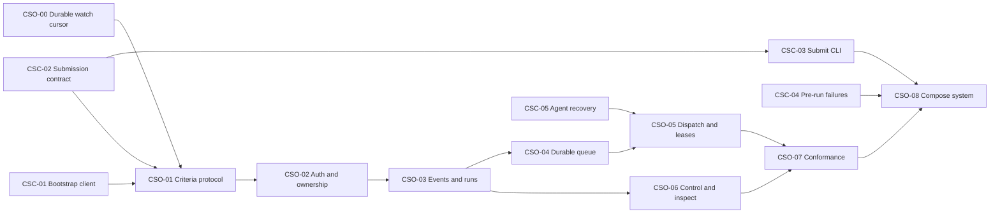
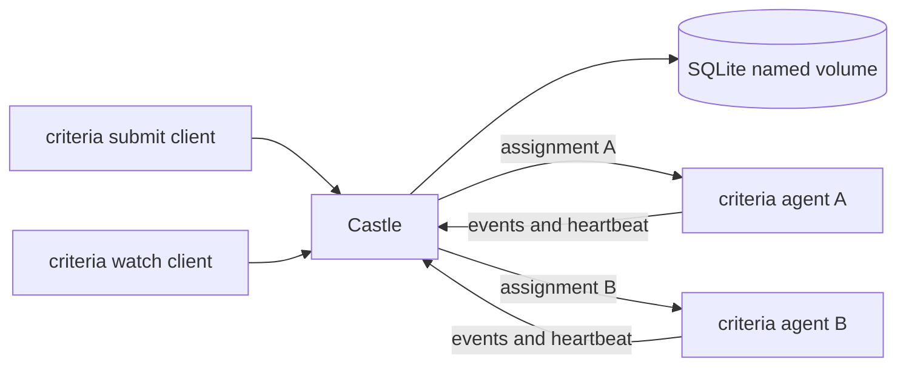

# Experiment 3: Criteria Server on Castle

Date: 2026-08-30

Status: implementation complete; live Compose repetition pending

Live validation follow-ups: CRI-77 fixed the agent health-check false negative found at Castle `da34b2a36cee982af9f8819fc9042558d7948d54`. CRI-78 fixed concurrent submission `SQLITE_BUSY`. CRI-79 fixed missed in-flight recovery across a Castle restart. CRI-80's separate-network helper repair did not remove its Compose event visibility in the live run; CRI-81 tracks the narrower helper lifecycle repair.

Repositories:

- `brokenbots/criteria`: agent, client, and portable server protocol
- `brokenbots/castle`: Castle implementation, Parapet, persistence, dispatch, and Compose system

## Objective

Turn Castle into a Criteria-compatible central server and prove the result in Docker Compose. Castle runs as a persistent container. One or more long-lived Criteria agent containers register with Castle, receive centrally queued workflows, execute them sequentially, and report durable events that an independent Criteria client can watch.

This is the third and final Linear intake experiment. Every implementation item is submitted through `linear_intake_v1`; the workflow investigates, writes a workstream, implements, reviews, opens a PR, waits for CI, and merges when its gates pass.

## Scope

The exercise targets a local Compose deployment, not EKS or high availability. Castle remains single-replica and uses its existing SQLite store on a named volume. Plaintext h2c is allowed only on the private Compose network. No PostgreSQL, distributed control registry, ingress, or Kubernetes resources are required.

Criteria fully replaces Overseer. Castle replaces its extracted `overlord.v1` handlers and event types with `criteria.v1`; Parapet migrates to `criteria.v1.ServerService`. No legacy wire compatibility is required.

## Operating Rules

1. At most one Linear intake job may actively modify `brokenbots/criteria`.
2. At most one Linear intake job may actively modify `brokenbots/castle`.
3. One Criteria job and one Castle job may run concurrently only when the dependency graph permits it.
4. Each job starts from the latest merged `origin/main` for its repository. Existing local feature branches and dirty files are not used as a base.
5. A cross-repository dependency must be merged before its consumer job starts. Temporary pseudo-versions or branch replacements must not be merged.
6. Every ticket names one target repository and has acceptance criteria executable in that repository.
7. Failed or interrupted jobs are retried only for the same ticket. A new ticket is not started in that repository until the current ticket reaches Done, In Review, or an explicitly recorded blocked state.
8. Compose system validation runs only after all implementation dependencies are merged.

Use distinct Compose project names and state directories for the two intake lanes:

```sh
docker compose -p intake-criteria \
  --env-file linear_intake_v1/.env.criteria \
  -f linear_intake_v1/compose.yaml run --rm linear-intake

docker compose -p intake-overlord \
  --env-file linear_intake_v1/.env.overlord \
  -f linear_intake_v1/compose.yaml run --rm linear-intake
```

The two lanes share provider capacity, so concurrent runs are optional. Sequential execution across both repositories is the fallback if model-server contention makes results unstable.

## Gate 0: Baselines

Before creating implementation tickets:

- Confirm the extracted Castle baseline remains `284d04b2af379da6c195f472ab9a8e0ee563b13f` or record the newer `origin/main`. `brokenbots/castle` was published from the history-preserving extraction on 2026-08-30.
- Confirm the workflow identity retains push access and the reviewer identity retains admin/review access to `brokenbots/castle`.
- Confirm both repositories have clean, passing `origin/main` revisions in disposable clones.
- Confirm Criteria's released long-lived agent includes `WorkflowAssignment` on the Control stream.
- Confirm Castle's event store supports every Criteria event variant or record the missing translations in CSO-03.
- Treat the retained `overlord.v1` schema and `shared/sdk/overseer` package as temporary migration scaffolding, not a compatibility commitment. CSO-01 removes them in favor of Criteria's SDK.
- Record immutable starting SHAs and the Criteria SDK version consumed by Castle.

Gate 0 does not modify source and is not a Linear implementation ticket.

## Planned Linear Work

Linear objects were created on 2026-08-30 with this immutable mapping:

| Planned key | Linear issue | Repository |
|---|---|---|
| CSC-01 | CRI-63 | `brokenbots/criteria` |
| CSC-02 | CRI-64 | `brokenbots/criteria` |
| CSC-03 | CRI-65 | `brokenbots/criteria` |
| CSC-04 | CRI-66 | `brokenbots/criteria` |
| CSC-05 | CRI-67 | `brokenbots/criteria` |
| CSO-00 | CRI-68 | `brokenbots/castle` |
| CSO-01 | CRI-69 | `brokenbots/castle` |
| CSO-02 | CRI-70 | `brokenbots/castle` |
| CSO-03 | CRI-71 | `brokenbots/castle` |
| CSO-04 | CRI-72 | `brokenbots/castle` |
| CSO-05 | CRI-73 | `brokenbots/castle` |
| CSO-06 | CRI-74 | `brokenbots/castle` |
| CSO-07 | CRI-75 | `brokenbots/castle` |
| CSO-08 | CRI-76 | `brokenbots/castle` |

### Criteria Repository

#### CSC-01: Send bootstrap credentials during agent registration

Add a non-interactive bootstrap-token input to `criteria agent` and server-backed apply registration. Support a direct flag and a file/environment source suitable for Compose secrets, attach `X-Server-Bootstrap` only to Register, avoid persisting or logging the bootstrap credential, and retain the server-issued per-agent token for subsequent RPCs.

Acceptance:

- Registration succeeds against a server requiring the correct bootstrap token.
- Missing and incorrect tokens fail without leaking either credential.
- Post-registration calls use only the issued agent token.
- Focused transport and CLI tests pass under the race detector.

#### CSC-02: Define portable workflow submission and assignment state

Extend the Criteria server SDK with the operator-side contract needed to queue a `WorkflowAssignment` and inspect its disposition. The request carries workflow name/source, labels, and an optional idempotency key; the response returns the server-created run ID and queue state. Keep agent delivery on the existing Control stream.

Acceptance:

- Generated Go and Connect bindings are updated by the repository generator and pass the drift check.
- The contract defines queued, leased/running, terminal, and rejected behavior.
- Duplicate idempotency keys cannot create duplicate runs.
- Authorization and ownership expectations are documented in the proto.

#### CSC-03: Add a `criteria submit` operator command

Add a client command that submits a workflow directory or compiled source to a Criteria server and prints the run ID. It supports labels, an idempotency key, TLS options consistent with `criteria watch`, and optional watch-through-terminal behavior.

Acceptance:

- Submission works through a real Connect handler, not only a mocked command layer.
- Invalid workflows, unreachable servers, duplicate submissions, and authentication failures have stable non-zero exits.
- `--watch` preserves the submitted run ID and returns the terminal workflow status.

#### CSC-04: Report pre-execution assignment failures centrally

Ensure an assigned run reports a terminal failure when workflow source cannot be compiled or execution cannot be initialized. Today these failures can occur before the run publisher exists and disappear from central observation.

Acceptance:

- Invalid assigned source produces a persisted `RunFailed` event with the assigned run ID.
- The agent remains available for its next assignment.
- Reconnect/replay cannot duplicate the terminal event.
- A focused test covers compile and initialization failures.

#### CSC-05: Harden assigned-run restart and duplicate delivery

Define and test agent behavior when its container exits after lease delivery, after `RunStarted`, and before the terminal acknowledgement. Re-delivery of the same assignment must reattach or decline deterministically and must never execute the workflow twice concurrently.

Acceptance:

- Restart uses persisted per-run state and Castle's canonical run ID.
- Duplicate delivery is idempotent while queued, running, and terminal.
- Pending events replay exactly once by correlation ID.
- The agent returns to its idle assignment loop after recovery.

### Castle Repository

#### CSO-00: Preserve the final watch cursor when SQLite is temporarily busy

The first CI run for the extracted Castle baseline failed under the race detector in `TestWatchRun_CursorUpdate_Coalesced`. The watcher received all 500 replay envelopes, but its durable subscriber cursor remained at sequence 451 after the final sequence-500 write returned `SQLITE_BUSY`. A successful WatchRun close must not silently lose acknowledged cursor progress because of a transient store conflict.

Reproduction evidence:

- Repository baseline: `284d04b2af379da6c195f472ab9a8e0ee563b13f`.
- GitHub Actions run: `https://github.com/brokenbots/castle/actions/runs/33351574243`.
- Command: `cd castle && go test -race ./...`.
- Failure: `TestWatchRun_CursorUpdate_Coalesced`, `cursor seq=451 want 500`.
- Correlated warning: `watch cursor persist failed`, `seq=500`, `database is locked (5) (SQLITE_BUSY)`.

Requested investigation: determine the required delivery/persistence contract for coalesced watch cursors, reproduce the transient conflict deterministically, and ensure a watcher cannot report clean completion while its final observed sequence is discarded. Preserve write coalescing and avoid timing-only tests.

Acceptance:

- A deterministic test injects or reproduces a transient final cursor-write failure.
- Successful WatchRun completion leaves the durable cursor at the last delivered event.
- Cursor updates remain monotonic and coalesced under concurrent replay.
- Focused repetition and the full Castle race-test suite pass.

#### CSO-01: Replace the legacy protocol with the Criteria SDK

Add the immutable Criteria SDK dependency and register `criteria.v1.CriteriaService` and `criteria.v1.ServerService` on Castle's Connect mux. Replace the extracted `overlord.v1` schema, generated bindings, SDK shim, handler names, and Parapet client model rather than maintaining dual services. Keep persistence models independent of generated wire types where practical.

Acceptance:

- No `OverseerService`, `CastleService`, or `overlord.v1` runtime endpoint remains.
- Criteria health/reflection endpoints are visible from Castle and Parapet builds against `criteria.v1.ServerService`.
- Package/import boundary tests prevent Criteria protobuf types from leaking into storage internals.
- Existing Castle tests remain green under `-race`.

Depends on: CSO-00, CSC-01, and CSC-02.

#### CSO-02: Implement Criteria registration, authentication, and ownership

Implement Criteria Register and authenticated agent RPCs using Castle's identity store. Accept `X-Server-Bootstrap` for registration, hash issued tokens, derive canonical identity from auth context, and enforce run ownership for heartbeat, create/reattach/resume, event submission, and Control subscriptions.

Acceptance:

- Correct bootstrap registration and bearer-token lifecycle pass Criteria conformance tests.
- Cross-agent run access returns `PERMISSION_DENIED`.
- Request-supplied agent IDs cannot override authenticated identity.
- Logs contain no bootstrap or bearer tokens.

Depends on: CSO-01.

#### CSO-03: Persist and serve the complete Criteria run/event model

Translate all current Criteria event variants into Castle's durable event representation and expose create/reattach, ordered acknowledgements, list, replay, watch, and terminal status through Criteria handlers. Preserve unknown payloads safely enough for forward-compatible replay or fail explicitly before acknowledgement.

Acceptance:

- Descriptor-driven coverage proves every Criteria Envelope arm has a storage/replay path.
- Sequence and correlation-ID deduplication survive Castle restart.
- Reattach returns current step, last sequence, variable scope, and pending signal.
- Historical replay followed by live watch has no gap or duplicate event.

Depends on: CSO-02.

#### CSO-04: Add durable assignment queue and idempotent submission

Add SQLite migrations and store APIs for queued workflow submissions, labels, leases, attempts, assignment ownership, idempotency keys, and terminal disposition. Implement the Criteria submission RPC from CSC-02.

Acceptance:

- Queue and run creation are one transaction.
- Submission idempotency survives Castle restart.
- Only eligible online agents can lease matching work.
- Lease expiry and terminal transitions are transactionally guarded.
- Migration and concurrent-claim tests pass under `-race`.

Depends on: CSO-03.

#### CSO-05: Dispatch assignments over Control with leases

Match queued work to connected Criteria agents by labels and send `WorkflowAssignment` through the existing Control registry. Track acceptance through `RunStarted`, expire unstarted leases, and prevent a run from being active on two agents.

Acceptance:

- One agent executes assignments sequentially.
- Two agents can execute distinct matching assignments concurrently.
- Disconnect before `RunStarted` requeues after lease expiry.
- Disconnect after `RunStarted` follows reattach policy without concurrent duplicate execution.
- Castle restart recovers queued and leased state.

Depends on: CSO-04 and CSC-05.

#### CSO-06: Implement Criteria operator control and inspection

Implement Criteria list/get/watch/stop plus PauseRun, ResumeRun, InspectRun, and SendPrompt where supported. Route live commands only to the authenticated owner and return explicit failed-precondition or unavailable responses when the agent is disconnected.

Acceptance:

- Stop, pause, resume, and prompt traverse the Criteria Control stream.
- Inspect reports the latest available adapter/run state without mutating it.
- Observer authorization is explicit and tested.
- Offline and terminal run behavior is deterministic.

Depends on: CSO-03. May run in parallel with CSO-04.

#### CSO-07: Add Criteria conformance coverage to Castle

Implement the Criteria SDK conformance Subject against an in-process Castle server, then extend it with assignment, bootstrap, ownership, restart, and negative-auth scenarios required by this project.

Acceptance:

- Tests exercise real Connect handlers and SQLite, not handler mocks.
- Every Criteria RPC has a success and relevant authorization/error case.
- The suite runs with `-race` and has no timing-only sleeps.
- The same suite can be invoked independently from the Compose system test.

Depends on: CSO-05 and CSO-06.

#### CSO-08: Ship the Castle plus Criteria-agent Compose system test

Add a Compose profile containing Castle, a submission client, and two long-lived Criteria agent containers. Use a named volume for Castle SQLite and separate persistent agent homes. Include health checks and a deterministic smoke harness.

Acceptance:

- A fresh `docker compose up --build` registers both agents without manual steps.
- The client submits at least two fixture workflows and watches both to successful completion.
- Label routing sends each fixture to the intended agent.
- Agent restart during a run demonstrates reattach and exactly-once event replay.
- Castle restart demonstrates durable queue, run history, and watch continuation.
- Invalid workflow submission or compilation is centrally visible as failed.
- Stop and pause/resume work from a separate client container.
- The test fails on timeout with collected Castle, agent, and client logs.
- The extracted Castle-only Compose behavior remains operational before Criteria agent services are added.

Depends on: CSC-03, CSC-04, CSC-05, CSO-07.

## Dependency Graph



## Recommended Execution Waves

| Wave | Criteria lane | Castle lane |
|---|---|---|
| 0 | Gate 0 baseline audit | Gate 0 baseline audit |
| 1 | CSC-01 | CSO-00 |
| 2 | CSC-02 | No job |
| 3 | CSC-03 | CSO-01 |
| 4 | CSC-04 | CSO-02 |
| 5 | CSC-05 | CSO-03 |
| 6 | No job | CSO-04 |
| 7 | No job | CSO-06 |
| 8 | No job | CSO-05 |
| 9 | No job | CSO-07 |
| 10 | No job | CSO-08 |

CSO-06 may precede CSO-04, but keeping the Castle lane sequential avoids branch and generated-code conflicts. CSC-04 and CSC-05 may start earlier after CSC-02 if their contracts are stable.

## Intake Configuration

Create two ignored environment files from `linear_intake_v1/.env.example`.

Experiment runtime: Criteria `v0.5.12`, released from `8ef3c05514ede491a48a1e7a9715acf29d11c43b` by GitHub Actions run `33351961059`. The validated intake image is `sha256:d27d1c64643fc7a46e9402aee6e581306d017f2b4c79acf2353a6b16cac09577`.

Criteria lane:

```dotenv
REPO_URL=brokenbots/criteria
BUILD_CMD=make build
TEST_CMD=make test
CI_GATE_CMD=make build && make test
TEST_REFS=both
MAIN_REF=origin/main
```

Castle lane:

```dotenv
REPO_URL=brokenbots/castle
BUILD_CMD=make build
TEST_CMD=make test
CI_GATE_CMD=make ci
TEST_REFS=main
MAIN_REF=origin/main
```

Each environment file also receives the existing Linear, workflow GitHub, reviewer GitHub, state-name, and provider settings. `TICKET_ID` changes for each run. Do not source these files as shell scripts; values such as `CI_GATE_CMD` contain spaces and are intended for Compose's env-file parser.

## Compose Target Topology



Suggested services:

- `castle`: built from `brokenbots/castle`, health checked, SQLite at `/data/castle.db`.
- `criteria-agent-a`: built from a pinned Criteria release/commit, labels `lane=a`, persistent `/home/criteria` volume.
- `criteria-agent-b`: same image, labels `lane=b`, separate home volume.
- `criteria-client`: one-shot profile containing `criteria submit`, `criteria watch`, and operator control commands.
- `smoke`: deterministic shell harness that submits fixtures, restarts services, asserts event histories, and exports logs.

No host port is required for automated validation. An optional `8080:8080` mapping may be enabled for manual inspection.

## Project Exit Criteria

The project is complete only when:

1. All fourteen implementation tickets have a recorded terminal disposition.
2. All merged PRs pass their repository's required GitHub checks.
3. Castle serves Criteria agents and Parapet with no legacy `overlord.v1` runtime services.
4. Correct and incorrect bootstrap/authentication paths are demonstrated.
5. Submission, label matching, sequential per-agent execution, and parallel multi-agent execution are demonstrated.
6. Agent and Castle restart scenarios preserve run identity, queue state, and ordered deduplicated history.
7. Invalid assigned workflows produce centrally watchable terminal failures.
8. Stop, pause/resume, inspect, and watch work from a container separate from the executing agent.
9. The full Compose smoke test passes twice from a clean volume and once while preserving/reusing the Castle volume.
10. The experiment ledger records every workflow decision, retry, intervention, PR, merge SHA, and residual risk.

## Run Ledger Template

Append one section per ticket to `criteria-linear-intake-evaluations.md`:

```md
### CRI-NN: <title>

- Repository and baseline SHA:
- Planned key:
- Dependency state:
- Start/end time and Compose project:
- Intake and QA route:
- PR and merge SHA:
- Local and GitHub validation:
- Cross-repository contract version:
- Interruptions/retries:
- Operator interventions:
- Residual risks:
```

After CSO-08, append one project-level review comparing the observed system with every exit criterion. A ticket reaching In Review because QA rejects its evidence is a valid workflow result but does not waive a required system capability; the missing capability must be clarified and resubmitted or explicitly removed from scope with rationale.